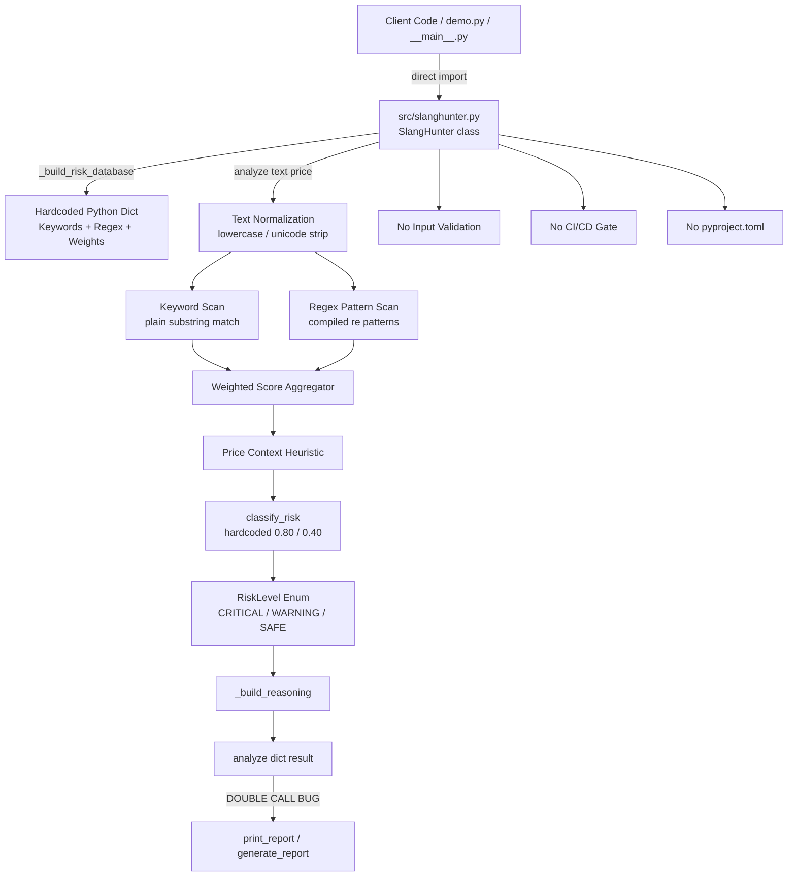
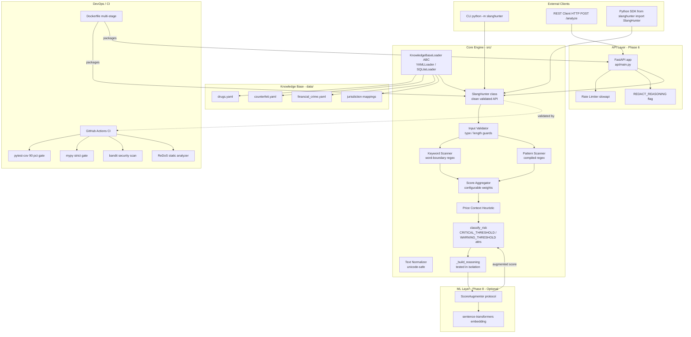

# IMPROVEMENT PLAN — `slanghunter`

| Field | Value |
|---|---|
| **Document Version** | 1.0.0 |
| **Date** | 2026-04-13 |
| **Prepared By** | Principal Software Architect |
| **Project** | `slanghunter` v0.1.0 |
| **Status** | APPROVED FOR EXECUTION |

---

## Project Description

`slanghunter` is a deterministic, rule-based Trust & Safety (T&S) engine written in pure Python (zero external runtime dependencies) designed to detect illegal and policy-violating listings on online marketplaces. Its domain coverage spans narcotics, money laundering, counterfeit goods, and controlled substances. The engine implements a multi-stage analysis pipeline: knowledge-base lookup → text normalization → keyword scanning → regex pattern matching → price-context heuristics → weighted scoring → a traffic-light risk verdict (`CRITICAL` / `WARNING` / `SAFE`). At v0.1.0 the project ships an 853-line single-file engine, a 90-test suite, and an interactive CLI demo, but lacks packaging infrastructure, CI/CD, and REST API exposure.

---

## Executive Summary

### Strengths

`slanghunter` demonstrates sound domain modeling and a disciplined single-responsibility design for its core analysis pipeline. The `RiskLevel` enum with embedded emoji, label, and action attributes is an idiomatic, expressive pattern that simplifies consuming code. The 90-test suite provides meaningful functional coverage of the primary happy-path and evasion-pattern scenarios. The deliberate choice of zero external runtime dependencies is architecturally significant for compliance contexts where third-party supply-chain risk must be minimized.

### Weaknesses & Risk Areas

Four critical bugs exist that directly compromise correctness and production readiness: a double-invocation of `analyze()` inside `print_report()` introduces both a performance defect and a latent consistency hazard; hardcoded scoring thresholds contradict their own docstring promise of configurability; multi-word keyword matching lacks word-boundary enforcement creating measurable false-positive exposure; and the complete absence of input validation in `analyze()` constitutes a Denial-of-Service surface for any REST API wrapper. Structurally, the entire knowledge base is embedded in Python source requiring a source-code change and redeployment for every rule update — a critical operational bottleneck for a compliance product that must respond to emerging slang in hours, not sprint cycles.

### Strategic Assessment

The project is well-positioned for production graduation but requires a structured remediation sprint before the Phase 6 REST API can be responsibly deployed. The improvements catalogued below are grouped into six categories, totalling **22 discrete items**. The highest-return investments are: (1) fixing the four critical bugs, (2) externalizing the knowledge base, and (3) establishing CI/CD with coverage and type-checking gates. Phases 6–8 of the README roadmap remain architecturally sound and are fully spec'd in Category F below.

---

## Improvement Catalog

### Category A — Critical Bugs

> Items that are functionally wrong or represent latent production risks.

---

#### A-01 — Double `analyze()` Invocation in `print_report()`

| Field | Detail |
|---|---|
| **ID** | A-01 |
| **Priority** | P1 |
| **Effort** | Small |
| **File(s) Affected** | [`src/slanghunter.py`](src/slanghunter.py) |

**Description:**
[`print_report()`](src/slanghunter.py) calls [`analyze()`](src/slanghunter.py) once to generate the printed console report and then calls it a second independent time to populate the returned dictionary. Because [`analyze()`](src/slanghunter.py) is deterministic this is currently benign, but it doubles CPU cost per call and creates a latent consistency defect: if any statefulness, caching, or non-determinism is ever introduced into the pipeline, the printed report and the returned dict will silently diverge.

**Recommended Solution:**
Refactor [`print_report()`](src/slanghunter.py) to call [`analyze()`](src/slanghunter.py) exactly once, assign the result to a local variable, pass that variable to [`generate_report()`](src/slanghunter.py) for printing, and then return it. The single call must be the ground truth for both the side-effect and the return value.

---

#### A-02 — Hardcoded Classification Thresholds Contradict Documented Configurability

| Field | Detail |
|---|---|
| **ID** | A-02 |
| **Priority** | P1 |
| **Effort** | Small |
| **File(s) Affected** | [`src/slanghunter.py`](src/slanghunter.py) |

**Description:**
The [`classify_risk()`](src/slanghunter.py) method has inline magic numbers `0.80` and `0.40` for its `CRITICAL` and `WARNING` thresholds. The docstring explicitly states these thresholds are "configurable on the class," yet no class-level attributes exist for them. Consumers who subclass `SlangHunter` to tune sensitivity for their platform discover the documentation is false only at runtime.

**Recommended Solution:**
Promote thresholds to class-level attributes: `CRITICAL_THRESHOLD: float = 0.80` and `WARNING_THRESHOLD: float = 0.40`. Update [`classify_risk()`](src/slanghunter.py) to reference `self.CRITICAL_THRESHOLD` and `self.WARNING_THRESHOLD`, and remove the inline literals. Update the docstring to accurately reflect the mechanism.

---

#### A-03 — Multi-Word Keyword Matching Lacks Word-Boundary Enforcement

| Field | Detail |
|---|---|
| **ID** | A-03 |
| **Priority** | P1 |
| **Effort** | Small |
| **File(s) Affected** | [`src/slanghunter.py`](src/slanghunter.py) |

**Description:**
The keyword scanning stage checks `kw in normalized` (plain substring match). For single-token keywords this is acceptable because the normalization pipeline typically tokenizes. For multi-word phrases such as `"western union"` this will produce false positives: the string `"northwestern unionized workers"` contains `"western union"` as a substring and would be incorrectly flagged. In a compliance context, false positives carry legal and reputational risk equivalent to false negatives.

**Recommended Solution:**
Replace plain `in` checks for multi-word keywords with a regex word-boundary match: compile `r'\b' + re.escape(kw) + r'\b'` at build time (inside [`_build_risk_database()`](src/slanghunter.py)) and store the compiled pattern alongside each keyword. At scan time, use `pattern.search(normalized)` instead of `kw in normalized`. Single-token keywords may retain the substring check if performance profiling justifies it, but applying the boundary check uniformly is safer.

---

#### A-04 — No Input Validation in `analyze()` — DoS and AttributeError Surface

| Field | Detail |
|---|---|
| **ID** | A-04 |
| **Priority** | P1 |
| **Effort** | Small |
| **File(s) Affected** | [`src/slanghunter.py`](src/slanghunter.py) |

**Description:**
[`analyze(text, price)`](src/slanghunter.py) performs no guard on `text`. Passing `None` raises an opaque `AttributeError` deep inside the normalization pipeline. Passing an unconstrained multi-megabyte string will block the Python process for an arbitrary duration — a critical Denial-of-Service vector once a REST API wrapper exposes this engine over the network.

**Recommended Solution:**
Add a validation block at the entry point of [`analyze()`](src/slanghunter.py):
- Raise `TypeError` with a descriptive message if `text` is not a `str`.
- Raise `ValueError` if `len(text) > MAX_INPUT_LENGTH` where `MAX_INPUT_LENGTH` is a class attribute (default `10_000` characters, tunable by operators).
- Validate `price` is `None` or a non-negative `float`/`int`; raise `ValueError` otherwise.

---

### Category B — Code Quality & Architecture

> Structural improvements and maintainability refactors.

---

#### B-01 — Externalize Knowledge Base to YAML/JSON Data Files

| Field | Detail |
|---|---|
| **ID** | B-01 |
| **Priority** | P2 |
| **Effort** | Large |
| **File(s) Affected** | [`src/slanghunter.py`](src/slanghunter.py), new `data/` directory |

**Description:**
The entire risk knowledge base (keywords, regex patterns, categories, weights) is hardcoded Python inside [`_build_risk_database()`](src/slanghunter.py). Every rule change — adding an emerging drug slang term, updating a counterfeit brand pattern — requires editing source code, passing code review, and triggering a deployment. This is operationally untenable for a compliance product where threat vocabulary evolves daily.

**Recommended Solution:**
Create a `data/` directory containing YAML files per category (e.g., `data/drugs.yaml`, `data/counterfeit.yaml`, `data/financial_crime.yaml`). Define a schema per file: `keywords: list[str]`, `patterns: list[str]`, `weight: float`, `legal_references: list[str]`. Refactor [`_build_risk_database()`](src/slanghunter.py) to load and merge these files at instantiation. Add a `data_path` constructor argument to `SlangHunter.__init__()` for testability and operator override. Validate loaded data against a `pydantic` or `dataclasses`-based schema at load time.

---

#### B-02 — Reorder `RiskLevel` Definition to Top of File

| Field | Detail |
|---|---|
| **ID** | B-02 |
| **Priority** | P3 |
| **Effort** | Small |
| **File(s) Affected** | [`src/slanghunter.py`](src/slanghunter.py) |

**Description:**
`RiskLevel` is currently defined after `SlangHunter` in the source file. This forces a string forward reference `-> "RiskLevel"` in `SlangHunter`'s type annotations. Forward references reduce static analysis reliability and are a code smell indicating definition order problems.

**Recommended Solution:**
Move the `RiskLevel` enum class definition to the top of [`src/slanghunter.py`](src/slanghunter.py), immediately after imports. Update all `-> "RiskLevel"` annotations to `-> RiskLevel`. No behavioral change.

---

#### B-03 — Fix `demo.py` Direct Internal Import

| Field | Detail |
|---|---|
| **ID** | B-03 |
| **Priority** | P3 |
| **Effort** | Small |
| **File(s) Affected** | [`demo.py`](demo.py) |

**Description:**
[`demo.py`](demo.py) imports via `from src.slanghunter import SlangHunter` — the internal module path — instead of the public package API `from src import SlangHunter`. This bypasses the package's intended `__init__.py` abstraction layer; any refactoring that moves or renames the internal class would silently break the demo without failing any test.

**Recommended Solution:**
Change the import in [`demo.py`](demo.py) to `from src import SlangHunter`. Verify that [`src/__init__.py`](src/__init__.py) correctly re-exports `SlangHunter` at the package level.

---

#### B-04 — Decouple `__version__` from `importlib.metadata`

| Field | Detail |
|---|---|
| **ID** | B-04 |
| **Priority** | P3 |
| **Effort** | Small |
| **File(s) Affected** | [`src/__init__.py`](src/__init__.py), `pyproject.toml` (new) |

**Description:**
`__version__` is a hardcoded string literal with no linkage to a canonical version source. When a release is cut, developers must remember to update it in multiple places. Drift between Git tags, `pyproject.toml`, and `__version__` is a common source of release errors.

**Recommended Solution:**
After `pyproject.toml` is created (see D-01), replace the hardcoded string with `importlib.metadata.version("slanghunter")` wrapped in a `try/except PackageNotFoundError` fallback for editable-install environments. The single source of truth for version becomes `pyproject.toml`.

---

### Category C — Testing & Quality Assurance

> Test coverage gaps and quality tooling.

---

#### C-01 — Add `pytest-cov` and Enforce Coverage Gate

| Field | Detail |
|---|---|
| **ID** | C-01 |
| **Priority** | P2 |
| **Effort** | Small |
| **File(s) Affected** | [`requirements.txt`](requirements.txt), `pyproject.toml` (new) |

**Description:**
Coverage is entirely unmeasured. There is no automated gate that would fail the test suite if coverage drops below an acceptable threshold. Without measurement, coverage gaps accumulate silently.

**Recommended Solution:**
Add `pytest-cov` to development dependencies. Configure `[tool.pytest.ini_options]` in `pyproject.toml` with `--cov=src --cov-report=term-missing --cov-fail-under=90`. The 90% threshold is the defined success criterion.

---

#### C-02 — Add `mypy` and Enforce Strict Type Checking

| Field | Detail |
|---|---|
| **ID** | C-02 |
| **Priority** | P2 |
| **Effort** | Small |
| **File(s) Affected** | [`requirements.txt`](requirements.txt), `pyproject.toml` (new) |

**Description:**
No static type checker is configured or enforced. Several existing type annotations may be inconsistent or inaccurate (the forward-reference issue documented in B-02 is one symptom). `mypy` errors are currently undetected.

**Recommended Solution:**
Add `mypy` to development dependencies. Configure a `[tool.mypy]` section in `pyproject.toml` with `strict = true`. Resolve all existing `mypy` errors as part of this item. Add `mypy src/` to the CI gate.

---

#### C-03 — Add Isolation Tests for `adderall`, `crystal meth`, and `cloned card` Patterns

| Field | Detail |
|---|---|
| **ID** | C-03 |
| **Priority** | P2 |
| **Effort** | Small |
| **File(s) Affected** | [`tests/test_slanghunter.py`](tests/test_slanghunter.py) |

**Description:**
The patterns for `adderall`, `crystal meth`, and `cloned card` have no dedicated isolation tests. These are high-priority T&S signals. A silent regex regression would go undetected until a production false-negative report.

**Recommended Solution:**
Add a new `TestCriticalPatternIsolation` test class in [`tests/test_slanghunter.py`](tests/test_slanghunter.py) with individual parametrized test cases for each high-risk term, testing both the canonical form and at least two common evasion variants (character substitution, spacing).

---

#### C-04 — Add Isolation Tests for `_build_reasoning()` Method

| Field | Detail |
|---|---|
| **ID** | C-04 |
| **Priority** | P3 |
| **Effort** | Small |
| **File(s) Affected** | [`tests/test_slanghunter.py`](tests/test_slanghunter.py) |

**Description:**
[`_build_reasoning()`](src/slanghunter.py) is only exercised indirectly through [`analyze()`](src/slanghunter.py). If the reasoning-assembly logic is refactored independently, no test will catch a regression in the human-readable explanation output.

**Recommended Solution:**
Add direct unit tests for `SlangHunter._build_reasoning()` with controlled inputs (pre-constructed `matches` dicts and `flags` dicts), asserting exact reasoning string content. This also documents the expected contract of the private method.

---

#### C-05 — Add Unit Tests for `demo.py` Public Functions

| Field | Detail |
|---|---|
| **ID** | C-05 |
| **Priority** | P3 |
| **Effort** | Medium |
| **File(s) Affected** | [`demo.py`](demo.py), [`tests/test_slanghunter.py`](tests/test_slanghunter.py) |

**Description:**
[`demo.py`](demo.py) contains `phase_input()`, `phase_processing()`, `phase_verdict()`, and other display functions that are completely untested. While these are I/O-heavy display functions, the logic for selecting demo cases and composing output is testable.

**Recommended Solution:**
Create a `tests/test_demo.py` file. Use `unittest.mock.patch` to mock `time.sleep` and `sys.stdout` capture. Test that each phase function invokes the expected `SlangHunter` methods and produces output containing required substrings. At minimum, validate that `phase_processing()` returns a result dict with the expected keys.

---

#### C-06 — Add Unit Tests for `src/__main__.py` `main()` Function

| Field | Detail |
|---|---|
| **ID** | C-06 |
| **Priority** | P3 |
| **Effort** | Small |
| **File(s) Affected** | [`src/__main__.py`](src/__main__.py), [`tests/test_slanghunter.py`](tests/test_slanghunter.py) |

**Description:**
The [`main()`](src/__main__.py) function in [`src/__main__.py`](src/__main__.py) is never invoked by the test suite. Breakage is only discovered when a user runs `python -m src` manually.

**Recommended Solution:**
Add a `TestCLIEntryPoint` test class. Use `subprocess.run(['python', '-m', 'src'], capture_output=True, text=True)` to invoke the CLI and assert exit code `0` and non-empty `stdout`. Alternatively, import and call `main()` directly, capturing `sys.stdout` with `contextlib.redirect_stdout`.

---

#### C-07 — Add Emoji Regex Pattern Isolation Tests

| Field | Detail |
|---|---|
| **ID** | C-07 |
| **Priority** | P3 |
| **Effort** | Small |
| **File(s) Affected** | [`tests/test_slanghunter.py`](tests/test_slanghunter.py) |

**Description:**
`TestSlangPatternMatching` covers text-based evasion but does not test emoji-substitution patterns in isolation. If the emoji regex compilation fails silently (as can happen with certain Unicode ranges on some Python builds), the failure is masked.

**Recommended Solution:**
Add a `TestEmojiPatternMatching` parametrized test class covering all documented emoji evasion patterns. Each test must assert that an input containing only the emoji variant (no text) produces a `CRITICAL` or `WARNING` result as appropriate.

---

### Category D — Packaging & DevOps

> Packaging infrastructure, CI/CD, and deployment configuration.

---

#### D-01 — Create `pyproject.toml` with Full Packaging Metadata

| Field | Detail |
|---|---|
| **ID** | D-01 |
| **Priority** | P1 |
| **Effort** | Small |
| **File(s) Affected** | `pyproject.toml` (new) |

**Description:**
The project has no `pyproject.toml`. It cannot be installed via `pip install .`, cannot declare entry points, and has no authoritative metadata (author, license SPDX identifier, homepage, classifiers). This blocks PyPI publication, Docker image builds using `pip install`, and `importlib.metadata` version resolution.

**Recommended Solution:**
Create `pyproject.toml` using the `[build-system]` table pointing to `hatchling` (or `setuptools >= 61`). Define `[project]` with `name`, `version`, `description`, `license`, SPDX classifier, `requires-python = ">=3.10"`, `dependencies = []` (zero runtime deps preserved), and `[project.optional-dependencies]` for `dev` extras. Define `[project.scripts]` entry point `slanghunter = "src.__main__:main"`.

---

#### D-02 — Implement GitHub Actions CI/CD Pipeline

| Field | Detail |
|---|---|
| **ID** | D-02 |
| **Priority** | P2 |
| **Effort** | Medium |
| **File(s) Affected** | `.github/workflows/ci.yml` (new) |

**Description:**
No CI/CD configuration exists. Pull requests are merged without automated validation of tests, coverage, or type correctness. This is a blocking gap before any Phase 6 REST API is deployed.

**Recommended Solution:**
Create `.github/workflows/ci.yml` with the following jobs:
- **lint**: `ruff check src/ tests/` (style gate)
- **typecheck**: `mypy src/` (type gate)
- **test**: `pytest --cov=src --cov-fail-under=90` on Python 3.10, 3.11, 3.12 matrix
- **security**: `bandit -r src/` + `safety check` (dependency vulnerability scan)

Trigger on `push` to `main` and all `pull_request` events. Add a status badge to [`README.md`](README.md).

---

#### D-03 — Create `Dockerfile` for REST API Deployment

| Field | Detail |
|---|---|
| **ID** | D-03 |
| **Priority** | P2 |
| **Effort** | Medium |
| **File(s) Affected** | `Dockerfile` (new), `.dockerignore` (new) |

**Description:**
No `Dockerfile` exists. Phase 6 (FastAPI REST API) cannot be containerized without one. A production T&S service must be deployable as a reproducible, isolated container.

**Recommended Solution:**
Create a multi-stage `Dockerfile`: Stage 1 (`builder`) installs dependencies via `pip install --no-cache-dir .[api]`; Stage 2 (`runtime`) uses `python:3.12-slim`, copies only the installed package and the `data/` directory, runs as a non-root `appuser`, and exposes port `8000`. Create `.dockerignore` excluding `tests/`, `demo.py`, `.git`, `.github`, `*.pyc`, and `__pycache__`.

---

#### D-04 — Fix `README.md` Placeholder GitHub URL

| Field | Detail |
|---|---|
| **ID** | D-04 |
| **Priority** | P3 |
| **Effort** | Small |
| **File(s) Affected** | [`README.md`](README.md) |

**Description:**
[`README.md`](README.md) contains `<your-username>` as a placeholder in the GitHub repository URL. This was never replaced with the actual repository owner. It signals an incomplete, unprofessional document to external contributors and prospective users.

**Recommended Solution:**
Replace all `<your-username>` occurrences in [`README.md`](README.md) with the actual GitHub username/organization. Add CI badge URLs using the Actions shield format once D-02 is complete.

---

#### D-05 — Create `CHANGELOG.md`

| Field | Detail |
|---|---|
| **ID** | D-05 |
| **Priority** | P4 |
| **Effort** | Small |
| **File(s) Affected** | `CHANGELOG.md` (new) |

**Description:**
No `CHANGELOG.md` exists. Version history is opaque. Operators tracking security patches or business-rule updates have no auditable record of what changed between releases — a meaningful gap for a compliance-oriented tool.

**Recommended Solution:**
Create `CHANGELOG.md` following the [Keep a Changelog](https://keepachangelog.com) format (`## [Unreleased]`, `## [0.1.0] - YYYY-MM-DD`). Document the initial feature set under `0.1.0`. In `pyproject.toml`, reference the changelog URL in `[project.urls]`.

---

### Category E — Security

> Input validation, DoS protection, ReDoS prevention, and jurisdiction coverage.

---

#### E-01 — Enforce Maximum Input Length to Prevent DoS

| Field | Detail |
|---|---|
| **ID** | E-01 |
| **Priority** | P1 |
| **Effort** | Small |
| **File(s) Affected** | [`src/slanghunter.py`](src/slanghunter.py) |

**Description:**
*See also A-04.* This item specifically tracks the security classification of unbounded text input as a DoS vector. A single API call with a 100 MB string payload would block the entire Python process for seconds to minutes, enabling a trivial single-threaded denial-of-service attack against any deployment.

**Recommended Solution:**
Introduce `MAX_INPUT_LENGTH: int = 10_000` as a class attribute. Enforce in [`analyze()`](src/slanghunter.py) with an immediate `ValueError` before any processing begins. Operators may override at instantiation. Document this limit in the API reference and OpenAPI schema.

---

#### E-02 — Add ReDoS Static Analysis Gate to CI

| Field | Detail |
|---|---|
| **ID** | E-02 |
| **Priority** | P2 |
| **Effort** | Small |
| **File(s) Affected** | `.github/workflows/ci.yml` (new), `data/` (new, from B-01) |

**Description:**
Current regex patterns in [`_build_risk_database()`](src/slanghunter.py) are safe, but the externalized knowledge base (B-01) opens a contribution pathway for community-added patterns. Exponential-time regex (ReDoS) is a subtle, high-severity vulnerability that cannot be caught by functional tests.

**Recommended Solution:**
Add `vuln-regex-detector` or `regexploit` as a CI step that statically analyzes all regex patterns loaded from the `data/` YAML files. Fail the CI pipeline on any pattern classified as potentially catastrophic. Document this policy in `CONTRIBUTING.md`.

---

#### E-03 — Document Knowledge Base Access Control Policy

| Field | Detail |
|---|---|
| **ID** | E-03 |
| **Priority** | P3 |
| **Effort** | Small |
| **File(s) Affected** | `SECURITY.md` (new) |

**Description:**
The knowledge base (detection keywords and patterns) is exposed fully in-process. Adversarial sellers with access to a deployed instance (e.g., via a REST API that returns verbose `reasoning` fields) could reverse-engineer detection vocabulary and trivially craft evasion listings.

**Recommended Solution:**
Create `SECURITY.md` documenting the threat model. For REST API deployments (Phase 6), introduce a `REDACT_REASONING` environment variable flag. When `True`, the `reasoning` field in API responses is replaced with a generic message. Internal/admin endpoints may expose full reasoning behind authentication.

---

#### E-04 — Expand Legal Citation Coverage Beyond US Jurisdiction

| Field | Detail |
|---|---|
| **ID** | E-04 |
| **Priority** | P3 |
| **Effort** | Medium |
| **File(s) Affected** | [`src/slanghunter.py`](src/slanghunter.py), `data/` (new, from B-01) |

**Description:**
Legal references embedded in the knowledge base are exclusively US-centric (DEA scheduling, US federal statutes). `slanghunter` is documented as applicable to Mercari (Japanese-origin platform) and by extension any global marketplace. Operating without jurisdictional coverage creates a legal gap for non-US operators deploying this engine.

**Recommended Solution:**
After B-01 externalizes the knowledge base to YAML, add a `legal_references` array per category supporting multiple jurisdiction objects: `{ jurisdiction: "JP", statute: "..."}`, `{ jurisdiction: "EU", statute: "..."}`. Update report generation to surface the applicable jurisdiction's references based on a configurable `jurisdiction` parameter passed to the `SlangHunter` constructor.

---

### Category F — Future Features

> Roadmap Phases 6–8 implementation guidance.

---

#### F-01 — Phase 6: FastAPI REST API Wrapper

| Field | Detail |
|---|---|
| **ID** | F-01 |
| **Priority** | P2 |
| **Effort** | Large |
| **File(s) Affected** | `api/` (new directory), `api/main.py`, `api/models.py`, `api/routers/analysis.py` |

**Description:**
The README roadmap defines Phase 6 as a REST API exposure of the engine. `slanghunter`'s zero-dependency design makes it trivially wrappable. The primary architectural concerns are: input validation at the HTTP layer (redundant with but separate from A-04/E-01 guards), async execution model, and avoiding shared mutable state in the `SlangHunter` instance under concurrent load.

**Recommended Solution:**
Structure the API package as follows:

- `api/main.py` — FastAPI `app` instantiation, CORS configuration, health endpoint `/health`
- `api/models.py` — Pydantic `AnalysisRequest` (`text: str`, `price: float | None`) and `AnalysisResponse` (mirroring the `analyze()` dict schema with full type annotations)
- `api/routers/analysis.py` — `POST /analyze` endpoint; instantiate `SlangHunter` as a FastAPI dependency singleton; delegate to `hunter.analyze()`; map response to `AnalysisResponse`
- Add `slanghunter[api]` optional dependency group in `pyproject.toml`: `fastapi >= 0.110`, `uvicorn[standard]`
- The `REDACT_REASONING` flag from E-03 is applied here before serializing the response
- Rate limiting via `slowapi` middleware to complement E-01

---

#### F-02 — Phase 7: External Knowledge Base with Live Reload

| Field | Detail |
|---|---|
| **ID** | F-02 |
| **Priority** | P2 |
| **Effort** | Large |
| **File(s) Affected** | `data/` (new), [`src/slanghunter.py`](src/slanghunter.py) |

**Description:**
Building directly on B-01 (YAML externalization), Phase 7 extends the knowledge base to support database-backed storage with a live-reload mechanism. This enables compliance operators to update detection rules without restarting the service — a critical operational requirement for a production T&S system.

**Recommended Solution:**
- Define a `KnowledgeBaseLoader` abstract base class with a `load() -> RuleSet` method
- Implement `YAMLLoader` (default, from B-01) and `SQLiteLoader` (for database-backed rules)
- Add a `watchdog`-based file watcher that calls `hunter.reload_knowledge_base()` when YAML files change in development/staging environments
- For production (Phase 6 API), expose an authenticated `POST /admin/reload` endpoint that triggers a live rule reload without restart
- Add `slanghunter[db]` optional dependency group: `sqlalchemy >= 2.0`, `watchdog`

---

#### F-03 — Phase 8: ML Enhancement Layer

| Field | Detail |
|---|---|
| **ID** | F-03 |
| **Priority** | P3 |
| **Effort** | Large |
| **File(s) Affected** | `ml/` (new directory), [`src/slanghunter.py`](src/slanghunter.py) |

**Description:**
The README defines Phase 8 as an ML enhancement layer. The critical architectural constraint is that the deterministic rule engine must remain the ground truth — the ML layer is a scoring supplement, not a replacement. This preserves auditability and legal defensibility, which are non-negotiable for a T&S tool used in compliance contexts.

**Recommended Solution:**
- Implement the ML layer as an optional `ScoreAugmentor` protocol: `augment(text: str, base_score: float) -> float`
- Default implementation is a no-op (preserves zero-dependency runtime)
- Optional implementation uses a fine-tuned `sentence-transformers` embedding model to compute a semantic similarity score against a corpus of known violating listings
- The augmented score is blended with the rule-based score via a configurable `ml_weight` parameter (default `0.0`)
- Training data pipeline lives in `ml/` and is out-of-scope for the core `src/` package
- Add `slanghunter[ml]` optional dependency group: `sentence-transformers`, `torch`
- Legal defensibility note: all CRITICAL verdicts triggering enforcement actions must be traceable to a specific matching rule, not solely an ML score

---

## Implementation Phasing

The following table defines the recommended execution sequence, grouping items by assembly-line phase and sprint cohort.

| Sprint | Phase | Agent | Items | Rationale |
|---|---|---|---|---|
| **S0** | Environment & Hygiene | DevOps | D-01, D-04 | `pyproject.toml` is a prerequisite for all install-based tooling; README fix is zero-risk |
| **S1** | Critical Bug Fixes | Code | A-01, A-02, A-03, A-04 / E-01 | Correctness and security blockers; must be resolved before any further feature work |
| **S1** | Quality Gate Setup | DevOps | C-01, C-02 | Coverage and type gates must be established before new code is added |
| **S2** | Code Quality Refactor | Code | B-02, B-03, B-04 | Low-risk structural cleanup; improves developer ergonomics for subsequent work |
| **S2** | Test Coverage Expansion | Code | C-03, C-04, C-05, C-06, C-07 | Fill coverage gaps before the knowledge base is externalized |
| **S3** | Knowledge Base Externalization | Code + Architect | B-01, F-02 | Major structural change; requires its own sprint to avoid destabilizing S1 fixes |
| **S3** | Security Hardening | Code | E-02, E-03, E-04 | Can only begin after B-01 provides the YAML contribution pathway |
| **S3** | DevOps Pipeline | DevOps | D-02, D-03, D-05 | CI/CD and Dockerfile are unblocked once packaging and tests are stable |
| **S3** | Security Audit | Security Reviewer | E-01, E-02, E-03 | Mandatory checkpoint before Phase 6 API is built |
| **S4** | REST API | Code | F-01 | Builds on stable, tested, containerized foundation from S3 |
| **S4** | Documentation | Docs Writer | D-04, D-05, SECURITY.md | Final packaging pass for public/team release |
| **S5** | ML Layer | Architect + Code | F-03 | Deferred until deterministic engine is fully hardened |

---

## Architecture Diagrams

### Current State — As-Is Architecture

### Target State — To-Be Architecture

---

## Risk Register

| Risk ID | Description | Likelihood | Impact | Mitigation |
|---|---|---|---|---|
| R-01 | B-01 YAML externalization breaks existing knowledge base completeness | Medium | High | Write a validation schema test that asserts loaded rule count equals the original hardcoded count before removing old code |
| R-02 | A-03 word-boundary fix introduces regressions in existing passing tests | Medium | Medium | Run full test suite after each individual keyword pattern change; use parametrized tests to isolate impact |
| R-03 | F-01 FastAPI singleton SlangHunter is not thread-safe if mutable state is added | Low | High | Audit SlangHunter for shared mutable state before Phase 6; use FastAPI Depends with a single immutable instance |
| R-04 | E-02 ReDoS scanner produces false positives on legitimate patterns and blocks CI | Low | Medium | Maintain a `regex-allowlist.txt` for audited patterns that are exempt from the ReDoS gate |
| R-05 | F-03 ML layer blending erodes legal defensibility of CRITICAL verdicts | Medium | High | Enforce the rule that CRITICAL verdicts must have at least one matched rule; ML score cannot alone produce CRITICAL |
| R-06 | B-01 externalization exposes rule vocabulary to filesystem readers on shared infrastructure | Medium | High | Encrypt YAML knowledge base at rest in production deployments; restrict filesystem ACLs on data/ directory |
| R-07 | D-02 CI matrix across Python 3.10/3.11/3.12 reveals version-specific incompatibilities | Low | Medium | Pin minimum required APIs to Python 3.10 stdlib; avoid 3.11+ match-statement syntax in core engine |
| R-08 | pyproject.toml D-01 packaging changes break current editable install workflows during transition | Medium | Low | Test with pip install -e . in a clean venv before merging; document migration steps in CHANGELOG |

---

## Success Metrics

The following measurable criteria define "done" for the full improvement effort. All metrics must pass in CI on the `main` branch.

| ID | Metric | Target | Measurement Method |
|---|---|---|---|
| SM-01 | Test coverage — line | ≥ 90% | `pytest --cov=src --cov-fail-under=90` |
| SM-02 | Test coverage — branch | ≥ 85% | `pytest --cov=src --cov-branch --cov-fail-under=85` |
| SM-03 | `mypy` errors | 0 errors | `mypy src/ --strict` |
| SM-04 | `bandit` high-severity findings | 0 findings | `bandit -r src/ -ll` |
| SM-05 | `ruff` lint violations | 0 violations | `ruff check src/ tests/` |
| SM-06 | ReDoS vulnerable patterns | 0 patterns | ReDoS static analyzer CI step |
| SM-07 | `print_report()` `analyze()` call count | Exactly 1 | Unit test asserting `mock_analyze.call_count == 1` |
| SM-08 | `analyze(None)` error type | `TypeError` with message | Unit test asserting `pytest.raises(TypeError, match=...)` |
| SM-09 | `analyze("x" * 10001)` error type | `ValueError` with message | Unit test asserting `pytest.raises(ValueError, match="MAX_INPUT_LENGTH")` |
| SM-10 | `SlangHunter` installable via `pip install .` | Exit code 0 | `pip install .` in clean venv in CI |
| SM-11 | Docker image builds without error | Exit code 0 | `docker build .` in CI |
| SM-12 | FastAPI health endpoint response | HTTP 200 `{"status": "ok"}` | Integration test in CI via `httpx` |
| SM-13 | Knowledge base YAML rule count ≥ original | Count parity | Automated assertion in test suite |
| SM-14 | CI pipeline runtime | ≤ 3 minutes | GitHub Actions job duration metric |

---

*End of Document — `IMPROVEMENT_PLAN.md` v1.0.0*
*Prepared for review by the Director: Luis Daniel Dos Santos, Legal Engineer*
