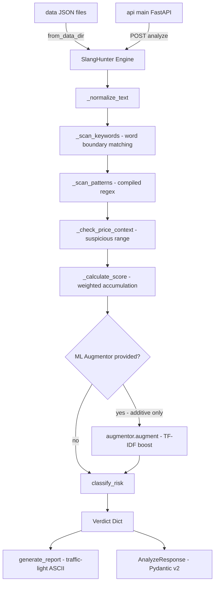

# 🔍 SlangHunter

[](https://github.com/L2santos29/slanghunter/actions/workflows/ci.yml)


**Automated Semantic Risk Detection for Trust & Safety Teams**

> *From manual keyword blocklists to contextual legal-risk scoring — detecting fraud-indicative slang that basic filters miss.*

---

## 📋 Table of Contents

- [What is SlangHunter?](#what-is-slanghunter)
- [Quick Start](#-quick-start)
- [Installation Options](#-installation-options)
- [Python API Usage](#-python-api-usage)
- [REST API](#-rest-api)
- [Architecture](#️-architecture)
- [Knowledge Base](#-knowledge-base)
- [Security Configuration](#-security-configuration)
- [Docker Deployment](#-docker-deployment)
- [Development Setup](#️-development-setup)
- [Roadmap](#-roadmap)
- [Legal Disclaimer](#️-legal-disclaimer)
- [License](#-license)

---

## What is SlangHunter?

**SlangHunter** is a deterministic, rule-based Trust & Safety engine for detecting illegal and high-risk listings on online marketplaces. It goes beyond simple keyword blocklists by combining compiled regex patterns for evasion detection (character substitution, emoji encoding, deliberate spacing), contextual price analysis, and legal citation traceability into a single, auditable risk score.

The engine is designed around a core architectural philosophy: **data is not logic**. The knowledge base — crime categories, keywords, regex patterns, price thresholds, and legal references — lives in externalized JSON files. The engine is the loop that reads them. If a law changes, or a new evasion tactic emerges, an operator edits a JSON file and hot-reloads the engine without touching a single line of Python.

Every flag produced by SlangHunter traces back to a specific U.S. federal statute (and its Japanese legal equivalent). A compliance auditor can ask *"why was this listing blocked?"* and receive a legal citation — not just a confidence number. This explainability-first design makes SlangHunter suitable for use in regulated environments where automated decisions must be defensible.

An optional **ML augmentation layer** is available via `pip install slanghunter[ml]`. It provides a TF-IDF + Logistic Regression confidence booster trained from the knowledge base vocabulary. This layer is strictly additive — it can raise a score, but it cannot manufacture a `CRITICAL` verdict on its own. **A `CRITICAL` verdict always requires at least one rule-based match. ML augmentation cannot override this guarantee.**

---

## ⚡ Quick Start

```bash
git clone https://github.com/L2santos29/slanghunter.git
cd slanghunter
pip install -e ".[dev]"
python demo.py          # animated 4-listing Mercari feed simulation
python -m src           # quick 8-case CLI demo
pytest                  # run 133 tests (~98% coverage)
```

> **Requirements:** Python 3.10+ · Git

---

## 📦 Installation Options

SlangHunter's core engine has **zero runtime dependencies** — it runs on the Python standard library alone. Optional extras activate additional capabilities:

| Extra | Command | Installs |
|---|---|---|
| **Core** (no deps) | `pip install -e .` | SlangHunter engine only |
| **Development** | `pip install -e ".[dev]"` | + pytest, flake8, pytest-cov, mypy |
| **REST API** | `pip install -e ".[api]"` | + FastAPI, Uvicorn, Pydantic v2 |
| **ML Layer** | `pip install -e ".[ml]"` | + scikit-learn |
| **Everything** | `pip install -e ".[all]"` | All of the above |

For exact reproducibility in CI or production, use the pinned lock files instead of floating ranges:

```bash
pip install -r requirements-dev.lock -e .     # development
pip install -r requirements-api.lock -e .     # API deployment
pip install -r requirements-ml.lock  -e .     # ML augmentation
```

---

## 🐍 Python API Usage

### 1 — Basic Analysis (Built-in Knowledge Base)

```python
from src import SlangHunter

hunter = SlangHunter()

verdict = hunter.analyze(
    text="got them p3rcs 💊 real pharma hmu",
    price=30.00
)

print(verdict["risk_score"])           # 0.8
print(verdict["flags"])                # ['drugs:pat:p3rcs', 'drugs:price_context']
print(verdict["matched_categories"])   # ['drugs']
print(verdict["reasoning"])            # [DRUGS] ... Legal basis: 21 U.S.C. § 841
```

### 2 — Externalized Knowledge Base (`from_data_dir()`)

```python
from src import SlangHunter

# Load rules from data/*.json — editable without restarting the process
hunter = SlangHunter.from_data_dir()

# Hot-reload rules at runtime (e.g. after editing a JSON file)
hunter.reload_from_data_dir()

verdict = hunter.analyze(
    text="1:1 replica Jordan 1 comes in original box 🔥",
    price=65.00
)
print(verdict["matched_categories"])   # ['surikae']
```

### 3 — ML-Enhanced Analysis (`analyze_enhanced()`)

> ⚠️ **Architecture Mandate:** ML augmentation is additive only. Without at least one rule-based hit, the score is capped below the WARNING threshold regardless of ML confidence. Install `slanghunter[ml]` before running this example.

```python
from src import SlangHunter
from src.ml import TfidfAugmentor

hunter = SlangHunter.from_data_dir()

# Train augmentor from the loaded knowledge base vocabulary
augmentor = TfidfAugmentor.from_knowledge_base(hunter.risk_database)

result = hunter.analyze_enhanced(
    text="premium leans and p3rcs real scripts dm me",
    price=35.00,
    augmentor=augmentor,
)

print(result["risk_score"])        # base rule-based score
print(result["ml_boosted_score"])  # score after ML boost (capped at 1.0)
print(result["ml_confidence"])     # raw positive-class probability
print(result["ml_augmented"])      # True
```

### 4 — Traffic-Light Report Generation

```python
from src import SlangHunter

hunter = SlangHunter()

report = hunter.generate_report(
    text="Jordan 1 Retro - 1:1 replica, comes in original box 🔥",
    price=65.00
)
print(report)
```

Output:
```
============================================================
  🔴  SLANGHUNTER VERDICT: CRITICAL
============================================================
  Listing : Jordan 1 Retro - 1:1 replica, comes in original box 🔥
  Price   : $65.00

  Risk Score : [██████████████████████████████] 100%
  Risk Level : 🔴  CRITICAL
  Action     : AUTOMATIC BLOCK — Escalate to Legal

  ┌─ FLAGS ────────────────────────────────────────────────
  │  ⚑  surikae:kw:1:1
  │  ⚑  surikae:kw:replica
  │  ⚑  surikae:kw:comes in original box
  │  ⚑  surikae:pat:1:1
  │  ⚑  surikae:pat:🔥
  │  ⚑  surikae:price_context
  └─────────────────────────────────────────────────────────

  ┌─ REASONING (Traceability) ─────────────────────────────
  │  [SURIKAE]
  │    Keywords matched: '1:1', 'replica', 'comes in original box'
  │    Slang patterns matched: '1:1', '🔥'
  │    Price falls within suspicious range.
  │    Legal basis: 18 U.S.C. § 2320 — Trafficking in Counterfeit Goods
  └─────────────────────────────────────────────────────────

  Categories : SURIKAE
============================================================
```

---

## 🌐 REST API

**Install and run:**

```bash
pip install -e ".[api]"
uvicorn api.main:app --reload
```

The API is available at `http://localhost:8000`. Interactive OpenAPI docs are at `http://localhost:8000/docs`.

### Endpoint Reference

| Method | Path | Description | Auth Required |
|---|---|---|---|
| `GET` | `/health` | Liveness check — returns `{"status": "ok", "version": "..."}` | No |
| `GET` | `/categories` | List all loaded knowledge-base category names | No |
| `GET` | `/categories/{name}` | Return metadata for a single category | No |
| `POST` | `/analyze` | Analyze listing text and return a risk verdict | No |
| `POST` | `/reload` | Hot-reload `data/*.json` into the running engine | `X-Reload-Key` header |

### Example: Analyze a Listing

```bash
curl -s -X POST http://localhost:8000/analyze \
  -H "Content-Type: application/json" \
  -d '{"text": "p3rcs real scripts dm me", "price": 30.0}' | python3 -m json.tool
```

```json
{
  "risk_score": 0.65,
  "risk_level": "CRITICAL",
  "risk_emoji": "🔴",
  "risk_action": "AUTOMATIC BLOCK — Escalate to Legal",
  "flags": ["drugs:pat:p3rcs"],
  "matched_categories": ["drugs"],
  "reasoning": "[DRUGS]\n  ...\n  Legal basis: 21 U.S.C. § 841"
}
```

### Example: Health Check

```bash
curl -s http://localhost:8000/health
# {"status": "ok", "version": "0.2.0"}
```

### Example: Hot-Reload Knowledge Base

```bash
curl -s -X POST http://localhost:8000/reload \
  -H "X-Reload-Key: your-secret-key"
# {"status": "reloaded", "categories": ["drugs", "money_laundering", "surikae"]}
```

---

## 🏗️ Architecture



**Pipeline stages:**

| Stage | Method | Description |
|---|---|---|
| Normalize | `_normalize_text()` | Lowercase + whitespace collapse; emojis and special chars preserved |
| Keyword scan | `_scan_keywords()` | Word-boundary regex search; prevents substring false positives |
| Pattern scan | `_scan_patterns()` | Compiled regex for evasion tactics (char swap, emoji, spacing) |
| Price context | `_check_price_context()` | Price amplifies score only when textual evidence already exists |
| Score | `_calculate_score()` | Weighted accumulation clamped to `[0.0, 1.0]`; max across categories |
| ML augment | `augmentor.augment()` | Optional additive boost; capped below WARNING if no rule hits |
| Classify | `classify_risk()` | Score → `RiskLevel` enum (CRITICAL / WARNING / SAFE) |

---

## 📚 Knowledge Base

Three crime categories, each with keyword lists, compiled regex patterns, a price suspicion window, and dual legal references (US + Japanese statutes). The knowledge base is externalized to [`data/`](data/) and can be edited without code changes.

| Category | Keywords | Regex Patterns | Price Window | US Statute | JP Statute |
|---|---|---|---|---|---|
| **Drugs** | 35 | 8 | $0 – $80 | [21 U.S.C. § 841](https://www.law.cornell.edu/uscode/text/21/841) | 薬機法 Art. 24 |
| **Money Laundering** | 39 | 7 | $0 – $50 | [18 U.S.C. § 1956](https://www.law.cornell.edu/uscode/text/18/1956) | 組織犯罪処罰法 Art. 10 |
| **Surikae** *(すり替え)* | 35 | 7 | $30 – $250 | [18 U.S.C. § 2320](https://www.law.cornell.edu/uscode/text/18/2320) | 不正競争防止法 Art. 2 |
| **Total** | **109** | **22** | — | — | — |

> **Surikae** (すり替え) is the Japanese term for "bait-and-switch" — selling counterfeit or misrepresented goods under the guise of authentic products.

**Knowledge base files** live in [`data/`](data/). See [`data/README.md`](data/README.md) for the exact JSON schema. To extend the engine with new signals, edit a JSON file and call `hunter.reload_from_data_dir()` — no restart required.

### Scoring Weights

| Signal | Weight | Example |
|---|---|---|
| Keyword match | **+0.15** | `"lean"` found → +0.15 |
| Regex pattern match | **+0.25** | `"p3rcs"` via regex → +0.25 |
| Price in suspicious range | **+0.20** | $25 + text evidence → +0.20 |
| Combo bonus (text + price) | **+0.10** | Both present → extra +0.10 |

- Score is **clamped to `[0.0, 1.0]`**.
- Price is an **amplifier**, not a standalone detector — `$45 bookshelf` scores `0.0`.
- Final score is the **max across all categories**.

### Risk Levels

| Level | Threshold | Emoji | Action |
|---|---|---|---|
| **CRITICAL** | Score > 80% | 🔴 | Automatic block → Escalate to Legal |
| **WARNING** | Score > 40% | 🟡 | Manual review → T&S analyst queue |
| **SAFE** | Score ≤ 40% | 🟢 | Approved → No action required |

Thresholds are configurable class attributes (`SlangHunter.THRESHOLD_CRITICAL = 0.80`, `SlangHunter.THRESHOLD_WARNING = 0.40`) — override via subclassing.

---

## 🔒 Security Configuration

All security-sensitive behavior is controlled via environment variables. Copy [`.env.example`](.env.example) to `.env` and fill in your values before deploying.

| Variable | Default | Description |
|---|---|---|
| `SLANGHUNTER_RELOAD_KEY` | *(unset)* | API key for the `/reload` endpoint. **Required in production.** If unset, `/reload` is unauthenticated (development only). |
| `SLANGHUNTER_CORS_ORIGINS` | *(empty)* | Comma-separated allowed CORS origins. Empty = same-origin only. |
| `SLANGHUNTER_RATE_LIMIT_MAX_REQUESTS` | `60` | Maximum requests per window per client IP. |
| `SLANGHUNTER_RATE_LIMIT_WINDOW_SECONDS` | `60` | Rate limit sliding window in seconds. |
| `SLANGHUNTER_TRUST_PROXY_HEADERS` | `false` | Enable only behind a trusted reverse proxy (nginx, Caddy). **Never `true` for direct internet-facing deployments.** |

> ⚠️ The `/reload` endpoint uses constant-time comparison (`secrets.compare_digest`) to prevent timing side-channel attacks. Always set `SLANGHUNTER_RELOAD_KEY` in any environment accessible from an untrusted network.

---

## 🐳 Docker Deployment

**Build and run manually:**

```bash
docker build -t slanghunter:latest .
docker run --rm -p 8000:8000 \
  -e SLANGHUNTER_RELOAD_KEY=your-secret-key \
  -v "$(pwd)/data:/app/data" \
  slanghunter:latest
```

**Or with Docker Compose:**

```bash
cp .env.example .env   # fill in your values
docker compose up
```

The [`Dockerfile`](Dockerfile) uses a multi-stage build with a non-root user and a Python stdlib healthcheck (no `curl` dependency):

```
HEALTHCHECK CMD python3 -c "import urllib.request; urllib.request.urlopen('http://localhost:8000/health')"
```

For local development overrides (port mapping, volume mounts, debug flags), create `docker-compose.override.yml` — it is gitignored and will be auto-merged by Docker Compose.

---

## 🛠️ Development Setup

```bash
# Clone and install all development dependencies
git clone https://github.com/L2santos29/slanghunter.git
cd slanghunter
python3 -m venv venv && source venv/bin/activate
pip install -e ".[dev]"

# Verify installation
pytest                                    # run 133 tests (~98% coverage)
flake8 src/ api/ tests/ demo.py          # lint (max-line-length=100)
mypy src/ --ignore-missing-imports        # type check
```

> For exact reproducibility, use `pip install -r requirements-dev.lock -e .` instead of the floating `[dev]` extra.

See [`CONTRIBUTING.md`](CONTRIBUTING.md) for the full contribution workflow and the knowledge-base extension guide.

---

## 🗺️ Roadmap

- [x] **Phase 1** — Project scaffolding and repository structure
- [x] **Phase 2** — Knowledge base architecture (`risk_database`)
- [x] **Phase 3** — Inference engine (normalize → scan → score → verdict)
- [x] **Phase 4** — Report interface and traffic-light system
- [x] **Phase 5** — Documentation, narrative, and portfolio polish
- [x] **Phase 5.5** — Live simulation demo (`demo.py`) and repo update
- [x] **Phase 6** — REST API wrapper (FastAPI + Pydantic v2 models + rate limiting + CORS)
- [x] **Phase 6.5** — ML augmentation layer (`TfidfAugmentor`, `ScoreAugmentor` protocol)
- [x] **Phase 6.6** — Externalized knowledge base (`data/*.json`, `from_data_dir()`, `reload_from_data_dir()`)
- [x] **Phase 6.7** — Security hardening (S5 audit: `/reload` key, rate limiting, proxy headers, ReDoS prevention)
- [x] **Phase 6.8** — DevOps hardening (multi-stage Dockerfile, non-root user, CI matrix, lock files)
- [ ] **Phase 7** — Batch processing and CSV/JSON ingestion
- [ ] **Phase 8** — Dashboard and analytics module

---

## ⚠️ Legal Disclaimer

> **This software is a prototype built for educational and demonstration purposes only.**
>
> SlangHunter is designed to showcase programmatic legal-risk analysis techniques and is **not intended for production deployment** without proper legal review, regulatory approval, and human oversight.
>
> The crime categories, keywords, and legal references included are **illustrative examples** drawn from publicly available U.S. federal statutes and Japanese legal codes. They do not constitute legal advice. The author assumes no liability for decisions made based on this tool's output.
>
> If you are building something like this for real: **hire a lawyer, not just an engineer.** Better yet — hire a Legal Engineer who can do both.

---

## 📄 License

This project is licensed under the **PolyForm NonCommercial 1.0.0** terms — see the [`LICENSE`](LICENSE) file for details.

---

<p align="center">
  <b>SlangHunter v0.2.0</b> — Built with 🧠 by a Legal Engineer who believes compliance can be automated.<br>
  <i>109 keywords · 22 regex patterns · 3 crime categories · 133 tests · ~98% coverage · 0 linter warnings</i>
</p>
